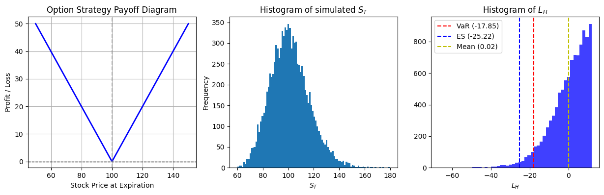
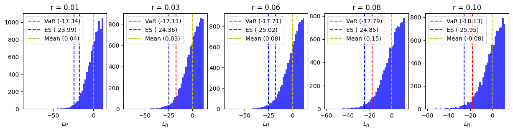
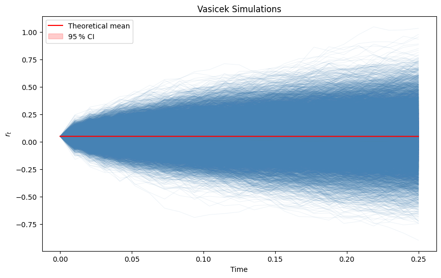
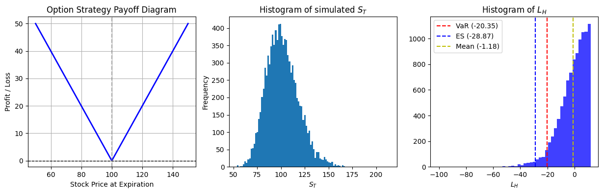

A research project with Imperial College London on options with stochastic interest volatility.

## Defining Options  

Analytical formulae for European calls and puts (Black‑Scholes):

$$
\begin{aligned}
C_0 &= \mathbb{E}\!\big[e^{-rT}(S_T-K)^+\big] \\
    &= S_0\,\Phi(d_1) - K\,e^{-rT}\,\Phi(d_2) \\
P_0 &= \mathbb{E}\!\big[e^{-rT}(K-S_T)^+\big] \\
    &= K\,e^{-rT}\,\Phi(-d_2) - S_0\,\Phi(-d_1)
\end{aligned}
$$

where  

$$
\begin{aligned}
d_1 &= \frac{\ln\!\big(\tfrac{S_0}{K}\big) + \big(r + \tfrac12\sigma^2\big)T}{\sigma\sqrt{T}},\\
d_2 &= d_1 - \sigma\sqrt{T}.
\end{aligned}
$$

The terminal price of the underlying asset under GBM is  

$$
S_T = S_0\,\exp\!\Bigl[(r - \tfrac12\sigma^2)T + \sigma W_T\Bigr].
$$

## Single Simulation  

- Plot the asset’s terminal stock price.  
- Compare analytical results with Monte‑Carlo results.  
- Plot loss over the time horizon of the strategy.

## Simulation With Interest Rates  

`OptionSimulator` can monitor how VaR and ES shift when the interest rate changes.

## Vasicek Model  

When short‑term rates are stochastic, we model them with the Vasicek (Ornstein‑Uhlenbeck) process:

$$
\begin{aligned}
dr_t &= k(\theta - r_t)\,dt + \sigma_2\,dW^{(1)}_t,\\
dS_t &= r_t\,S_t\,dt + \sigma_1\,S_t\,dW^{(2)}_t.
\end{aligned}
$$

To generate two correlated Brownian increments we use a Cholesky decomposition of the covariance matrix.

### Naïve Solution  

Assuming $r_t$ is constant over $[t,t+\Delta t]$,

$$
S_{t+\Delta t}=S_t + r_t S_t \Delta t + \sigma_1 S_t\,\Delta W^{(2)}_t .
$$

This discretisation yields  

$$
\mathbb{E}\!\big[S_{t+\Delta t}\mid\mathcal{F}_t\big]=S_t(1+r_t\Delta t),
$$

so the process drifts linearly upward and is not a martingale; the resulting distribution has an exaggerated heavy tail.

### Exact Solution  

Applying Itô’s lemma to $X_t:=\ln S_t$,

$$
dX_t = \bigl(r_t - \tfrac12\sigma_1^{2}\bigr)dt + \sigma_1\,dW^{(2)}_t .
$$

With $r_t$ frozen over the step and exponentiating,

$$
S_{t+\Delta t}=S_t\,
\exp\!\Bigl[\bigl(r_t-\tfrac12\sigma_1^{2}\bigr)\Delta t
           + \sigma_1\,\Delta W^{(2)}_t\Bigr],
$$

which preserves the martingale property $\mathbb{E}[S_{t+\Delta t}\mid\mathcal{F}_t]=S_t e^{r_t\Delta t}$.

### Interest‑Rate Distribution  

The Vasicek process has a closed‑form Gaussian distribution:

$$
\begin{aligned}
\mu_t &= r_0 e^{-kt} + \theta\bigl(1-e^{-kt}\bigr),\\
\sigma_t &= \sqrt{\frac{\sigma_2^{2}}{2k}\bigl(1-e^{-2kt}\bigr)}.
\end{aligned}
$$

(See e.g. *Ornstein‑Uhlenbeck* solutions.)

## Single Simulation with Stochastic Rates  

  

